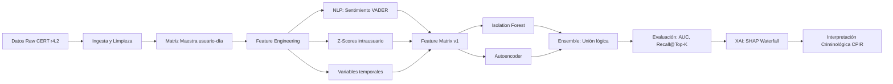

# 🛡️ TFM: Detección Conductual de Amenaza Interna (CERT r4.2)

[](https://www.python.org/)
[](https://creativecommons.org/licenses/by-nc/4.0/)
[](https://doi.org/10.5281/zenodo.19435851)
[](https://huggingface.co/spaces/Kamaranis/Internal-Threat-Detection-Ensemble-CPIR)

> **Trabajo Final de Máster en Ciencia de Datos**  
> **Universitat Oberta de Catalunya (UOC)**  
> **Autor:** Antonio Barrera Mora  
> **Director:** Blas Torregrosa García | **Directora PRA:** Esther Ibáñez  
> **Fecha de entrega:** 7 de abril de 2026  
> **Área:** NLP, Ciberseguridad y Visual Analytics (A2. NPL&VA)

---

## 📋 Resumen Ejecutivo

Este proyecto desarrolla un sistema híbrido de detección temprana de **amenaza interna** (*Insider Threat*) que integra:

| Dimensión | Fuentes | Variables Clave |
|-----------|---------|----------------|
| **Técnica** | `logon`, `http`, `usb`, `file` | Volumetría, horarios, actividad fuera de jornada |
| **Conductual** | `email` (NLP) | Deriva afectiva (`sentiment_z_user`), ventanas móviles |
| **Contextual** | `psychometric`, `ldap` | Big Five (OCEAN), rol, departamento (snapshot) |

**Resultados clave** (validación sobre CERT r4.2, 330k registros, 191 insiders confirmados):

| Modelo | AUC | Recall @ Top-0.5% | Insiders detectados |
|--------|-----|-------------------|---------------------|
| Isolation Forest (baseline) | **0.629** | 4.71% | 9 / 191 |
| Autoencoder (Deep Learning) | 0.551 | **11.52%** | 22 / 191 |
| **Ensemble (votación lógica)** | — | **12.57%** | **24 / 191** ✅ |

> 🔍 **Hallazgo principal**: La integración de señales técnicas y conductuales permite anticipar la amenaza interna investigando únicamente el **0.5% de la actividad corporativa diaria**, reduciendo drásticamente la fatiga de alertas operativa.

---

## 🎥 Demostración Interactiva

🔗 **[Internal Threat Detection Ensemble - CPIR (Hugging Face Space)](https://huggingface.co/spaces/Kamaranis/Internal-Threat-Detection-Ensemble-CPIR)**

Prueba el sistema en tiempo real:
- Altera variables conductuales (actividad, sentimiento, horarios)
- Observa el recálculo del Índice de Riesgo (0-100)
- Visualiza la explicación SHAP (Waterfall Plot) para auditoría forense

---

## 🎯 Objetivos del Trabajo

### Objetivo Principal
Desarrollar un modelo analítico de detección de anomalías que integre variables técnicas de TI con indicadores conductuales extraídos mediante NLP, para anticipar cambios de comportamiento de riesgo en entornos corporativos.

### Objetivos Secundarios
1. ✅ Estructurar datos heterogéneos de CERT r4.2 en una matriz de perfiles usuario-día.
2. ✅ Aplicar NLP (VADER) para extraer métricas de sentimiento y deriva afectiva.
3. ✅ Entrenar y comparar algoritmos no supervisados (Isolation Forest, Autoencoder) en contexto de desbalanceo extremo (1:1730).
4. ✅ Implementar capa XAI (SHAP) para traducir decisiones matemáticas en evidencia criminológica trazable.

---

## ❓ Preguntas de Investigación

### Pregunta General (PIG)
> ¿Es posible anticipar incidentes de amenaza interna mediante modelos no supervisados sobre una matriz conductual híbrida (técnica + psicológica)?

**Respuesta empírica**: ✅ **Sí**. El sistema detectó 24 atacantes reales (Recall 12.57%) investigando solo el 0.5% de la actividad.

### Preguntas Específicas (PIE)

| PIE | Pregunta | Respuesta Empírica |
|-----|----------|-------------------|
| **PIE 1** | ¿Mejora la deriva afectiva (`sentiment_z_user`) la capacidad predictiva? | ✅ **Sí, como confirmador**. El sentimiento no es predictor primario, pero contextualiza la anomalía técnica (SHAP ≈ −0.42). |
| **PIE 2** | ¿Qué Recall alcanzan modelos no supervisados sin sobremuestreo? | ✅ **12.57% @ Top-0.5%**. Métrica operativamente relevante frente al AUC global en desbalanceo extremo. |
| **PIE 3** | ¿Contribuye el Ensemble a maximizar la detección? | ✅ **Sí**. Complementariedad táctica: IF detecta anomalías volumétricas; AE captura desviaciones sutiles multidimensionales. |
| **PIE 4** | ¿Valida XAI las premisas del modelo CPIR? | ✅ **Sí**. SHAP mapea variables técnicas con fases CPIR ("preparación activa", "explotación") y confirma que los rasgos Big Five tienen contribución marginal (garantía ética). |

---

## 🗂️ Estructura del Repositorio

```text
.
├── README.md                          # Este archivo
├── requirements.txt                   # Dependencias Python
├── notebooks/
│   ├── 01_Exploracion.ipynb          # EDA inicial y validación de fuentes
│   ├── 02_Ingesta_Procesamiento.ipynb# Arquitectura ETL y matriz maestra
│   ├── 03_Ingenieria_Caracteristicas.ipynb # Feature engineering + shortlist
│   └── 04_Modelo_Deteccion.ipynb     # Modelado, evaluación y XAI
├── src/
│   ├── 01_ingesta_test_device.py     # Prueba de concepto CSV→Parquet
│   ├── 02_ingesta_http.py            # Procesamiento HTTP por chunks
│   ├── 03_ingesta_logon.py           # Agregación diaria de logon + after-hours
│   ├── 04_ingesta_email_nlp.py       # NLP VADER + agregación sentimiento
│   ├── 05_ingesta_file_psycho.py     # File + Psychometric processing
│   ├── 06_master_join.py             # Integración final: matriz maestra
│   └── check_setup.py                # Verificación de entorno
├── references/
│   ├── CERT_DOWNLOAD.md              # Instrucciones para obtener el dataset
│   └── dataset_structure.md          # Descripción estructural de CERT r4.2
├── models/                           # Modelos serializados (no versionados en Git)
│   ├── isolation_forest_v1.pkl
│   ├── autoencoder_v1.keras
│   └── scaler_v1.pkl
└── .gitignore                        # Excluye datos raw/processed y modelos
```

> ⚠️ **Nota sobre datos**: Los directorios `src/data/raw/` y `src/data/processed/` están excluidos por `.gitignore`. Debes preparar el dataset localmente siguiendo `references/CERT_DOWNLOAD.md`.

---

## 🚀 Quickstart: Ejecución Local

### 1. Clonar y preparar entorno
```bash
git clone <URL_DEL_REPOSITORIO>
cd "TFM_Insider_Threat (trabajando)"

# Crear entorno virtual (recomendado: conda o venv)
python -m venv .venv
source .venv/bin/activate  # Linux/macOS
# .venv\Scripts\activate  # Windows

# Instalar dependencias
pip install -r requirements.txt

# Verificar entorno
python src/check_setup.py
```

### 2. Preparar el dataset CERT r4.2
1. Solicita acceso al dataset en [SEI CERT Insider Threat Dataset](https://www.sei.cmu.edu/research/cert/datasets/insider-threat/)
2. Sigue las instrucciones en `references/CERT_DOWNLOAD.md` para estructurar:
   ```text
   src/data/raw/
   ├── logon.csv
   ├── device.csv
   ├── http.csv
   ├── email.csv
   ├── file.csv
   ├── psychometric.csv
   ├── ldap.csv          # Snapshot de mayo-2011 (copiar desde carpeta LDAP/)
   └── answers/
       └── insiders.csv  # Ground truth para evaluación
   ```

### 3. Ejecutar flujo completo (recomendado)
```bash
# Opción A: Notebooks interactivos (Jupyter Lab)
jupyter lab notebooks/

# Opción B: Pipeline por scripts (reproducible)
python src/01_ingesta_test_device.py
python src/02_ingesta_http.py
python src/03_ingesta_logon.py
python src/04_ingesta_email_nlp.py
python src/05_ingesta_file_psycho.py
python src/06_master_join.py
# Luego ejecutar notebooks 03 y 04 para feature engineering y modelado
```

### 4. Resultados esperados
Tras ejecutar el pipeline, se generarán en `src/data/processed/`:
- `master_behavioral_matrix.parquet` (330.452 filas × 17 columnas)
- `feature_matrix_v1.parquet` (330.452 filas × 33 columnas)
- `feature_shortlist_m34.csv` (top 20 variables candidatas)

---

## 🔬 Metodología Resumida



### Decisiones Metodológicas Clave
| Decisión | Justificación |
|----------|--------------|
| **Aprendizaje no supervisado** | Desbalanceo extremo (1 insider : 1.730 registros legítimos) invalida enfoques supervisados sin distorsión. |
| **Granularidad usuario-día** | Equilibrio entre señal conductual y viabilidad computacional; permite construir líneas base intrausuario. |
| **Shift(1) en ventanas móviles** | Evita data leakage: la predicción del día *t* solo depende de la historia *t-1, t-2...*. |
| **Imputación diferenciada** | Conteos → 0 (ausencia = no actividad); Sentimiento → 0.0 (neutralidad operativa); Dimensionales → NaN (preservar incertidumbre). |
| **Ensemble por unión lógica** | Maximiza Recall sin incrementar volumen de alertas: IF detecta anomalías descaradas; AE captura desviaciones sutiles. |

---

## 📊 Resultados Detallados

### Capacidad Discriminativa Global


> 📌 **Nota**: El AUC más bajo del Autoencoder (0.551) es esperable en desbalanceo extremo: la red concentra el error de reconstrucción en el umbral crítico superior, penalizando la métrica global pero mejorando el Recall operativo.

### Evaluación Táctica (Top-0.5% de alertas)
| Modelo | Alertas Investigadas | Insiders Detectados | Recall | Falsos Positivos Estimados* |
|--------|---------------------|---------------------|--------|----------------------------|
| Isolation Forest | 1.653 | 9 | 4.71% | ~1.644 |
| Autoencoder | 1.653 | 22 | 11.52% | ~1.631 |
| **Ensemble** | **1.653** | **24** | **12.57%** | **~1.629** |

\* Estimado asumiendo que el 0.5% restante son falsos positivos (escenario conservador).

### Explicabilidad SHAP: Caso Confirmado MPM0220


| Variable | Valor SHAP | Interpretación Criminológica |
|----------|------------|------------------------------|
| `after_hours_activity` | −1.99 | Explotación de ventanas de baja supervisión (CPIR: fase activa) |
| `total_logon_activity` | −1.86 | Hiperactividad técnica / movimiento lateral |
| `usb_activity_count` | −1.78 | Canal de exfiltración activo (triángulo de la oportunidad) |
| `file_activity_count` | −1.73 | Acceso masivo a archivos sensibles |
| `sentiment_z_user` | −0.42 | Deriva afectiva severa (Z = −2.817): confirmador motivacional |
| Big Five (O,C,E,A,N) | ≈ 0 | Sin contribución discriminante → garantía ética |

> 🔑 **Conclusión XAI**: El modelo no discrimina por rasgos estáticos de personalidad, sino por **comportamientos dinámicos observables**, alineándose con el principio de minimización de datos del RGPD.

---

## ⚖️ Consideraciones Éticas y Legales

Este trabajo se adhiere a los principios de **Privacy by Design** y **IA Responsable**:

| Principio | Implementación en el Proyecto |
|-----------|-------------------------------|
| **Minimización de datos** | NLP extrae únicamente metadato numérico de sentimiento; no se almacena ni procesa contenido textual completo. |
| **No discriminación** | SHAP confirma que los rasgos Big Five tienen contribución marginal; el sistema detecta *cómo actúa* el usuario, no *quién es*. |
| **Transparencia algorítmica** | Capa XAI (SHAP) garantiza el derecho a la explicación (RGPD Art. 13, AI Act). |
| **Supervisión humana** | Las alertas son indicadores de riesgo, no evidencia concluyente; requieren validación por analista humano. |
| **Finalidad académica** | Dataset sintético (CERT r4.2); cualquier uso aplicado requeriría EIPD/DPIA, consentimiento y supervisión de DPO. |

> 📜 **Marco normativo de referencia**: RGPD (UE) 2016/679, AI Act (UE) 2024/1689, Directiva NIS2.

---

## 📚 Citación Académica

Si utilizas este trabajo o los artefactos derivados, por favor cita:

```bibtex
@mastersthesis{barrera2026insider,
  title={Detección de amenaza interna centrada en el humano: Integración de análisis de logs corporativos y perfilado conductual},
  author={Barrera Mora, Antonio},
  school={Universitat Oberta de Catalunya},
  year={2026},
  type={Trabajo Final de Máster},
  url={https://github.com/Kamaranis/TFM_Insider_Threat},
  doi={10.5281/zenodo.19435851}
}
```

**Artefactos publicados**:
- 🗃️ [Matriz de características conductuales y psicométricas (Zenodo)](https://doi.org/10.5281/zenodo.19435851) - CC BY-NC 4.0
- 🤗 [Aplicación de inferencia interactiva (Hugging Face Space)](https://huggingface.co/spaces/Kamaranis/Internal-Threat-Detection-Ensemble-CPIR)

---

## 🤝 Contribuciones y Contacto

Este repositorio está abierto a colaboraciones académicas. Para:
- Reportar errores o sugerencias: abre un *Issue* en GitHub.
- Solicitar acceso a artefactos adicionales: contacta vía [LinkedIn](https://linkedin.com/in/antonio-barrera-mora) o correo institucional.
- Revisar la memoria completa: disponible bajo solicitud justificada (uso académico).

---

## 📄 Licencia

Este código y documentación están licenciados bajo [Creative Commons Attribution-NonCommercial 4.0 International](https://creativecommons.org/licenses/by-nc/4.0/).

> ✅ Puedes: compartir, adaptar, usar con fines académicos.  
> ❌ No puedes: uso comercial, redistribución sin atribución.  
> ℹ️ Debes: atribuir al autor, indicar cambios, enlazar a la licencia.

---

## 🔄 Estado del Proyecto

| Fase | Estado | Fecha |
|------|--------|-------|
| ✅ PEC1/M1: Definición y alcance | Completado | 01/03/2026 |
| ✅ PEC2/M2: Estado del arte | Completado | 22/03/2026 |
| ✅ PEC3/M3: Implementación y resultados | Completado | 10/05/2026 |
| ✅ PEC4/M4: Memoria y defensa | Completado | 02/06/2026 |
| 🚀 Publicación de artefactos | En curso | Abril 2026 |

---

> 💡 *"La seguridad no es solo proteger sistemas; es comprender a las personas que los usan."*  
> — Antonio Barrera Mora, 2026

----