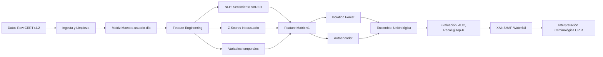
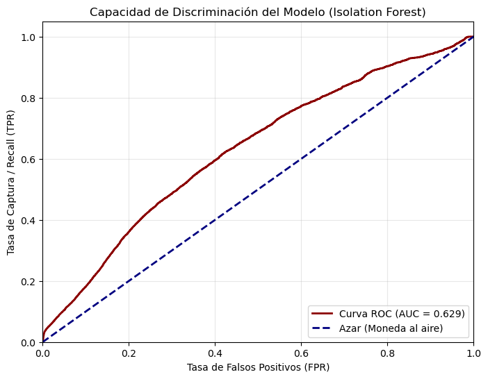
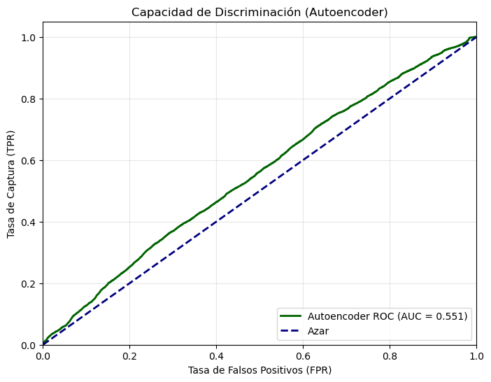

# 🛡️ TFM: Detección Conductual de Amenaza Interna (CERT r4.2)

[](https://www.python.org/)
[](https://creativecommons.org/licenses/by-nc/4.0/)
[](https://doi.org/10.5281/zenodo.19435851)
[](https://huggingface.co/spaces/Kamaranis/Internal-Threat-Detection-Ensemble-CPIR)

> **Trabajo Final de Máster en Ciencia de Datos**  
> **Universitat Oberta de Catalunya (UOC)**  
> **Autor:** Antonio Barrera Mora  
> **Director:** Blas Torregrosa García | **Directora PRA:** Esther Ibáñez  
> **Fecha de entrega:** 28 de abril de 2026 (M3)
> **Área:** NLP, Ciberseguridad y Visual Analytics (A2. NPL&VA)

---

- [🛡️ TFM: Detección Conductual de Amenaza Interna (CERT r4.2)](#️-tfm-detección-conductual-de-amenaza-interna-cert-r42)
  - [📋 Resumen Ejecutivo](#-resumen-ejecutivo)
  - [🎥 Demostración Interactiva](#-demostración-interactiva)
  - [🎯 Objetivos del Trabajo](#-objetivos-del-trabajo)
    - [Objetivo Principal](#objetivo-principal)
    - [Objetivos Secundarios](#objetivos-secundarios)
  - [❓ Preguntas de Investigación](#-preguntas-de-investigación)
    - [Pregunta General (PIG)](#pregunta-general-pig)
    - [Preguntas Específicas (PIE)](#preguntas-específicas-pie)
  - [🗂️ Estructura del Repositorio](#️-estructura-del-repositorio)
  - [🚀 Quickstart: Ejecución Local](#-quickstart-ejecución-local)
    - [1. Clonar y preparar entorno](#1-clonar-y-preparar-entorno)
    - [2. Preparar el dataset CERT r4.2](#2-preparar-el-dataset-cert-r42)
    - [3. Ejecutar flujo completo (recomendado)](#3-ejecutar-flujo-completo-recomendado)
    - [4. Resultados esperados](#4-resultados-esperados)
  - [🔬 Metodología Resumida](#-metodología-resumida)
    - [Decisiones Metodológicas Clave](#decisiones-metodológicas-clave)
  - [📊 Resultados Detallados](#-resultados-detallados)
    - [Capacidad Discriminativa Global](#capacidad-discriminativa-global)
    - [Evaluación Táctica (Top-0.5% de alertas)](#evaluación-táctica-top-05-de-alertas)
    - [Explicabilidad SHAP: Caso Confirmado MPM0220](#explicabilidad-shap-caso-confirmado-mpm0220)
  - [⚖️ Consideraciones Éticas y Legales](#️-consideraciones-éticas-y-legales)
  - [📚 Citación Académica](#-citación-académica)
  - [🤝 Contribuciones y Contacto](#-contribuciones-y-contacto)
  - [📄 Licencia](#-licencia)
  - [🔄 Estado del Proyecto](#-estado-del-proyecto)
  - [BIBLIOGRAFÍA](#bibliografía)

## 📋 Resumen ejecutivo

Este proyecto desarrolla un sistema híbrido de detección temprana de **amenaza interna** (*Insider Threat*) que integra:

| Dimensión | Fuentes | Variables Clave |
|-----------|---------|----------------|
| **Técnica** | `logon`, `http`, `usb`, `file` | Volumetría, horarios, actividad fuera de jornada |
| **Conductual** | `email` (NLP) | Deriva afectiva (`sentiment_z_user`), ventanas móviles |
| **Contextual** | `psychometric`, `ldap` | Big Five (OCEAN), rol, departamento (snapshot) |

**Resultados clave** (validación sobre CERT r4.2, 330k registros, 191 insiders confirmados):

| Modelo | AUC | Recall @ Top-0.5% | Insiders detectados |
|--------|-----|-------------------|---------------------|
| Isolation Forest (baseline) | **0.629** | 4.71% | 9 / 191 |
| Autoencoder (Deep Learning) | 0.551 | **11.52%** | 22 / 191 |
| **Ensemble (votación lógica)** | — | **12.57%** | **24 / 191** ✅ |

> 🔍 **Hallazgo principal**: La integración de señales técnicas y conductuales permite anticipar la amenaza interna investigando únicamente el **0.5% de la actividad corporativa diaria**, reduciendo drásticamente la fatiga de alertas operativa.

---

## 🎥 Demostración interactiva

🔗 **[Internal Threat Detection Ensemble - CPIR (Hugging Face Space)](https://huggingface.co/spaces/Kamaranis/Internal-Threat-Detection-Ensemble-CPIR)**

Prueba el sistema en tiempo real:
- Altera variables conductuales (actividad, sentimiento, horarios)
- Observa el recálculo del Índice de Riesgo (0-100)
- Visualiza la explicación SHAP (Waterfall Plot) para auditoría forense

---

## 🎯 Objetivos del Trabajo

### Objetivo principal

Desarrollar un modelo analítico de detección de anomalías que integre variables técnicas de TI con indicadores conductuales extraídos mediante NLP, para anticipar cambios de comportamiento de riesgo en entornos corporativos.

### Objetivos secundarios

1. ✅ Estructurar datos heterogéneos de CERT r4.2 en una matriz de perfiles usuario-día.
2. ✅ Aplicar NLP (VADER) para extraer métricas de sentimiento y deriva afectiva.
3. ✅ Entrenar y comparar algoritmos no supervisados (Isolation Forest, Autoencoder) en contexto de desbalanceo extremo (1:1730).
4. ✅ Implementar capa XAI (SHAP) para traducir decisiones matemáticas en evidencia criminológica trazable.

---

## ❓ Preguntas de Investigación

### Pregunta General (PIG)

> ¿Es posible anticipar incidentes de amenaza interna mediante modelos no supervisados sobre una matriz conductual híbrida (técnica + psicológica)?

**Respuesta empírica**: ✅ **Sí**. El sistema detectó 24 atacantes reales (Recall 12.57%) investigando solo el 0.5% de la actividad.

### Preguntas Específicas (PIE)

| PIE | Pregunta | Respuesta Empírica |
|-----|----------|-------------------|
| **PIE 1** | ¿Mejora la deriva afectiva (`sentiment_z_user`) la capacidad predictiva? | ✅ **Sí, como confirmador**. El sentimiento no es predictor primario, pero contextualiza la anomalía técnica (SHAP ≈ −0.42). |
| **PIE 2** | ¿Qué Recall alcanzan modelos no supervisados sin sobremuestreo? | ✅ **12.57% @ Top-0.5%**. Métrica operativamente relevante frente al AUC global en desbalanceo extremo. |
| **PIE 3** | ¿Contribuye el Ensemble a maximizar la detección? | ✅ **Sí**. Complementariedad táctica: IF detecta anomalías volumétricas; AE captura desviaciones sutiles multidimensionales. |
| **PIE 4** | ¿Valida XAI las premisas del modelo CPIR? | ✅ **Sí**. SHAP mapea variables técnicas con fases CPIR ("preparación activa", "explotación") y confirma que los rasgos Big Five tienen contribución marginal (garantía ética). |

---

## 🗂️ Estructura del Repositorio

```text
.
├── README.md                          # Este archivo
├── requirements.txt                   # Dependencias Python
├── notebooks/
│   ├── 01_Exploracion.ipynb          # EDA inicial y validación de fuentes
│   ├── 02_Ingesta_Procesamiento.ipynb# Arquitectura ETL y matriz maestra
│   ├── 03_Ingenieria_Caracteristicas.ipynb # Feature engineering + shortlist
│   └── 04_Modelo_Deteccion.ipynb     # Modelado, evaluación y XAI
├── src/
│   ├── 01_ingesta_test_device.py     # Prueba de concepto CSV→Parquet
│   ├── 02_ingesta_http.py            # Procesamiento HTTP por chunks
│   ├── 03_ingesta_logon.py           # Agregación diaria de logon + after-hours
│   ├── 04_ingesta_email_nlp.py       # NLP VADER + agregación sentimiento
│   ├── 05_ingesta_file_psycho.py     # File + Psychometric processing
│   ├── 06_master_join.py             # Integración final: matriz maestra
│   └── check_setup.py                # Verificación de entorno
├── references/
│   ├── CERT_DOWNLOAD.md              # Instrucciones para obtener el dataset
│   └── dataset_structure.md          # Descripción estructural de CERT r4.2
├── models/                           # Modelos serializados (no versionados en Git)
│   ├── isolation_forest_v1.pkl
│   ├── autoencoder_v1.keras
│   └── scaler_v1.pkl
└── .gitignore                        # Excluye datos raw/processed y modelos
```

> ⚠️ **Nota sobre datos**: Los directorios `src/data/raw/` y `src/data/processed/` están excluidos por `.gitignore`. Debes preparar el dataset localmente siguiendo `references/CERT_DOWNLOAD.md`.

---

## 🚀 Quickstart: Ejecución Local

### 1. Clonar y preparar entorno

```bash
git clone https://github.com/AnbarTop/Human_centered_internal_threat_detection.git
cd Human_centered_internal_threat_detection

# Crear entorno virtual (recomendado: conda o venv)
python -m venv .venv
source .venv/bin/activate  # Linux/macOS
# .venv\Scripts\activate  # Windows

# Instalar dependencias
pip install -r requirements.txt

# Verificar entorno
python src/check_setup.py
```

### 2. Preparar el dataset CERT r4.2

1. Visita [SEI CERT Insider Threat Dataset](https://kilthub.cmu.edu/articles/dataset/Insider_Threat_Test_Dataset/12841247/1) o bien
2. Sigue las instrucciones en `references/CERT_DOWNLOAD.md` para descargar y estructurar:
   ```text
   src/data/raw/
   ├── logon.csv
   ├── device.csv
   ├── http.csv
   ├── email.csv
   ├── file.csv
   ├── psychometric.csv
   ├── ldap.csv          # Snapshot de mayo-2011 (copiar desde carpeta LDAP/)
   └── answers/
       └── insiders.csv  # Ground truth para evaluación
   ```

### 3. Ejecuta flujo completo (recomendado)

```bash
# Opción A: Notebooks interactivos (Jupyter Lab)
jupyter lab notebooks/

# Opción B: Pipeline por scripts (reproducible)
python src/01_ingesta_test_device.py
python src/02_ingesta_http.py
python src/03_ingesta_logon.py
python src/04_ingesta_email_nlp.py
python src/05_ingesta_file_psycho.py
python src/06_master_join.py
# Luego ejecutar notebooks 03 y 04 para feature engineering y modelado
```

### 4. Resultados esperados

Tras ejecutar el pipeline, se generarán en `src/data/processed/`:
- `master_behavioral_matrix.parquet` (330.452 filas × 17 columnas)
- `feature_matrix_v1.parquet` (330.452 filas × 33 columnas)
- `feature_shortlist_m34.csv` (top 20 variables candidatas)

---

## 🔬 Metodología Resumida



### Decisiones metodológicas clave

| Decisión | Justificación |
|----------|--------------|
| **Aprendizaje no supervisado** | Desbalanceo extremo (1 insider : 1.730 registros legítimos) invalida enfoques supervisados sin distorsión. |
| **Granularidad usuario-día** | Equilibrio entre señal conductual y viabilidad computacional; permite construir líneas base intrausuario. |
| **Shift(1) en ventanas móviles** | Evita *data leakage*: la predicción del día *t* solo depende de la historia *t-1, t-2...*. |
| **Imputación diferenciada** | Conteos → 0 (ausencia = no actividad); Sentimiento → 0.0 (neutralidad operativa); Dimensionales → NaN (preservar incertidumbre). |
| **Ensemble por unión lógica** | Maximiza *Recall* sin incrementar volumen de alertas: IF detecta anomalías descaradas; AE captura desviaciones sutiles. |

---

## 📊 Resultados Detallados

### Capacidad discriminativa global

#### Curvas ROC comparativas entre modelos (AUC)

**Isolation Forest**: AUC = 0.629  


**Autoencoder**: AUC = 0.551  


> 📌 **Nota**: El AUC más bajo del Autoencoder (0.551) es esperable en desbalanceo extremo: la red concentra el error de reconstrucción en el umbral crítico superior, penalizando la métrica global pero mejorando el Recall operativo.

### Evaluación Táctica (Top-0.5% de alertas)

| Modelo | Alertas Investigadas | Insiders Detectados | Recall | Falsos Positivos Estimados* |
|--------|---------------------|---------------------|--------|----------------------------|
| Isolation Forest | 1.653 | 9 | 4.71% | ~1.644 |
| Autoencoder | 1.653 | 22 | 11.52% | ~1.631 |
| **Ensemble** | **1.653** | **24** | **12.57%** | **~1.629** |

\* Estimado asumiendo que el 0.5% restante son falsos positivos (escenario conservador).

### Explicabilidad SHAP: Caso Confirmado MPM0220


| Variable | Valor SHAP | Interpretación Criminológica |
|----------|------------|------------------------------|
| `after_hours_activity` | −1.99 | Explotación de ventanas de baja supervisión (CPIR: fase activa) |
| `total_logon_activity` | −1.86 | Hiperactividad técnica / movimiento lateral |
| `usb_activity_count` | −1.78 | Canal de exfiltración activo (triángulo de la oportunidad) |
| `file_activity_count` | −1.73 | Acceso masivo a archivos sensibles |
| `sentiment_z_user` | −0.42 | Deriva afectiva severa (Z = −2.817): confirmador motivacional |
| Big Five (O,C,E,A,N) | ≈ 0 | Sin contribución discriminante → garantía ética |

> 🔑 **Conclusión XAI**: El modelo no discrimina por rasgos estáticos de personalidad, sino por **comportamientos dinámicos observables**, alineándose con el principio de minimización de datos del RGPD.

---

## ⚖️ Consideraciones Éticas y Legales

Este trabajo se adhiere a los principios de **Privacy by Design** y **IA Responsable**:

| Principio | Implementación en el Proyecto |
|-----------|-------------------------------|
| **Minimización de datos** | NLP extrae únicamente metadato numérico de sentimiento; no se almacena ni procesa contenido textual completo. |
| **No discriminación** | SHAP confirma que los rasgos Big Five tienen contribución marginal; el sistema detecta *cómo actúa* el usuario, no *quién es*. |
| **Transparencia algorítmica** | Capa XAI (SHAP) garantiza el derecho a la explicación (RGPD Art. 13, AI Act). |
| **Supervisión humana** | Las alertas son indicadores de riesgo, no evidencia concluyente; requieren validación por analista humano. |
| **Finalidad académica** | Dataset sintético (CERT r4.2); cualquier uso aplicado requeriría EIPD/DPIA, consentimiento y supervisión de DPO. |

> 📜 **Marco normativo de referencia**: RGPD (UE) 2016/679, AI Act (UE) 2024/1689, Directiva NIS2.

---

## 📚 Citación Académica

Si utilizas este trabajo o los artefactos derivados, por favor cita:

```bibtex
@mastersthesis{barrera2026insider,
  title={Detección de amenaza interna centrada en el humano: Integración de análisis de logs corporativos y perfilado conductual},
  author={Barrera Mora, Antonio},
  school={Universitat Oberta de Catalunya},
  year={2026},
  type={Trabajo Final de Máster},
  url={https://github.com/AnbarTop/Human_centered_internal_threat_detection.git},
  doi={10.5281/zenodo.19435851}
}
```

O bien:

- Barrera Mora, A. (2026). *Detección de amenaza interna centrada en el humano: Integración de análisis de logs corporativos y perfilado conductual* (Trabajo Final de Máster, Universitat Oberta de Catalunya). Recuperado de https://github.com/AnbarTop/Human_centered_internal_threat_detection.git

**Artefactos publicados**:

- 🗃️ [Matriz de características conductuales y psicométricas (Zenodo)](https://doi.org/10.5281/zenodo.19435851) - CC BY-NC 4.0

- 🤗 [Aplicación de inferencia interactiva (Hugging Face Space)](https://huggingface.co/spaces/Kamaranis/Internal-Threat-Detection-Ensemble-CPIR)

---

## 🤝 Contribuciones y Contacto

Este repositorio está abierto a colaboraciones académicas. Para:
- Reportar errores o sugerencias: abre un *Issue* en GitHub.
- Solicitar acceso a artefactos adicionales: contacta vía [LinkedIn](https://linkedin.com/in/antonio-barrera-mora) o correo institucional.
- Revisar la memoria completa: disponible bajo solicitud justificada (uso académico).

---

## 📄 Licencia

Este código y documentación están licenciados bajo [Creative Commons Attribution-NonCommercial 4.0 International](https://creativecommons.org/licenses/by-nc/4.0/).

> ✅ Puedes: compartir, adaptar, usar con fines académicos.  
> ❌ No puedes: uso comercial, redistribución sin atribución.  
> ℹ️ Debes: atribuir al autor, indicar cambios, enlazar a la licencia.

---

## 🔄 Estado del Proyecto

| Fase | Estado | Fecha |
|------|--------|-------|
| ✅ PEC1/M1: Definición y alcance | Completado | 01/03/2026 |
| ✅ PEC2/M2: Estado del arte | Completado | 22/03/2026 |
| ✅ PEC3/M3: Implementación y resultados | Completado | 10/05/2026 |
| ✅ PEC4/M4: Memoria y defensa | Pendiente | 02/06/2026 |
| 🚀 Publicación de artefactos | Completado | Abril 2026 |

---

## BIBLIOGRAFÍA

- Abiola, O., Abayomi-Alli, A., Tale, O. A., Misra, S., & Abayomi-Alli, O. (2023). Sentiment analysis of COVID-19 tweets from selected hashtags in Nigeria using VADER and Text Blob analyser. Journal of Electrical Systems and Information Technology, 10(1), 5.

- Al-Mhiqani, M. N., Ahmad, R., Zainal Abidin, Z., Yassin, W., Hassan, A., Abdulkareem, K. H., Ali, N. S., & Yunos, Z. (2020). A review of insider threat detection: Classification, machine learning techniques, datasets, open challenges, and recommendations. Applied Sciences, 10(15), 5208.

- Anomaly Detection in Python with Isolation Forest | DigitalOcean. (s. f.). Recuperado 30 de marzo de 2026, de https://www.digitalocean.com/community/tutorials/anomaly-detection-isolation-forest

- Asad Hasan. (s. f.). Processed_CERT_Insider_Threat_dataset_using-CTI-framework [Dataset]. IEEE DataPort. https://doi.org/10.21227/TGSH-4409

- Ashton, M. C., & Lee, K. (2007). Empirical, Theoretical, and Practical Advantages of the HEXACO Model of Personality Structure. Personality and Social Psychology Review, 11(2), 150-166. https://doi.org/10.1177/1088868306294907

- Basu, S., Victoria Chua, Y. H., Wah Lee, M., Lim, W. G., Maszczyk, T., Guo, Z., & Dauwels, J. (2018). Towards a data-driven behavioral approach to prediction of insider-threat. 2018 IEEE International Conference on Big Data (Big Data), 4994-5001. https://doi.org/10.1109/BigData.2018.8622529

- Bedford, J. (2018). Organisational vulnerability to intentional insider threat.
Bell, A. J., Rogers, M. B., & Pearce, J. M. (2019). The insider threat: Behavioral indicators and factors influencing likelihood of intervention. International Journal of Critical Infrastructure Protection, 24, 166-176.

- Big Five Factors of Personality Traits, Age, and Employees’ Risky Mobile Device Behavior—ProQuest. (s. f.). Recuperado 24 de febrero de 2026, de https://www.proquest.com/openview/2be8346162e1b64db6470c2cb3f79370/1?pq-origsite=gscholar&cbl=18750

- Bronfenbrenner, U. (1977). Toward an experimental ecology of human development. American psychologist, 32(7), 513.
Bruns, M. (2020). Preventing Insider Threat at the Source. Utica College.

- California Consumer Privacy Act (CCPA) | State of California—Department of Justice—Office of the Attorney General. (s. f.). Recuperado 20 de abril de 2026, de https://oag.ca.gov/privacy/ccpa

- Cover, T. M., & Thomas, J. A. (1991). Entropy, relative entropy and mutual information. Elements of information theory, 2(1), 12-13.

- Culjak, G. (2012). Access, awareness and use of internet self-help websites for depression in university students. 2655-2664.

- Fayyad, D. (2025). Measuring the Human Risk Factor: Developing Predictive Models for Insider Threat Detection Using Behavioral Analytics. International Journal of 
Humanities and Information Technology, 7(4), 29-40.

- Glasser, J., & Lindauer, B. (2013). Bridging the gap: A pragmatic approach to generating insider threat data. 98-104.

- Greitzer, F. L., & Frincke, D. A. (2010). Combining traditional cyber security audit data with psychosocial data: Towards predictive modeling for insider threat mitigation. En Insider threats in cyber security (pp. 85-113). Springer.

- Greitzer, F. L., Kangas, L. J., Noonan, C. F., Brown, C. R., & Ferryman, T. (2013). Psychosocial modeling of insider threat risk based on behavioral and word use analysis. e-Service Journal: A Journal of Electronic Services in the Public and Private Sectors, 9(1), 106-138.

- Greitzer, F. L., Kangas, L. J., Noonan, C. F., Dalton, A. C., & Hohimer, R. E. (2012). Identifying at-risk employees: Modeling psychosocial precursors of potential insider threats. 2392-2401.

- Haq, M. A., & Alshehri, M. (2022). Insider Threat Detection Based on NLP Word Embedding and Machine Learning. Intelligent Automation and Soft Computing, 33, 619-635. https://doi.org/10.32604/iasc.2022.021430

- Hayes, S. C., Barnes-Holmes, D., & Roche, B. (Eds.). (2001). Relational frame theory: A post-Skinnerian account of human language and cognition. Kluwer Academic/Plenum Publishers.

- Hayes, S. C., Strosahl, K., & Wilson, K. G. (2016). Acceptance and commitment therapy: The process and practice of mindful change (Second edition, paperback edition). The Guilford Press.

- Hazarika, D., Konwar, G., Deb, S., & Bora, D. J. (2020). Sentiment Analysis on Twitter by Using TextBlob for Natural Language Processing. ICRMAT, 24, 63-67.

-Hutto, C., & Gilbert, E. (2014). Vader: A parsimonious rule-based model for sentiment analysis of social media text. 8(1), 216-225.

- Idensohn, C. J., & Flowerday, S. (2024). Malicious Insider Behaviour in Cybersecurity Informed by The Fraud Triangle. Journal of Information Systems Security (ISSN 1551-123), 22.

- Insider Threat Test Dataset. (2016, noviembre 28). https://www.sei.cmu.edu/library/insider-threat-test-dataset/

- IsolationForest. (s. f.). Scikit-Learn. Recuperado 30 de marzo de 2026, de https://scikit-learn/stable/modules/generated/sklearn.ensemble.IsolationForest.html

- Jiang, W., Tian, Y., Liu, W., & Liu, W. (2018, septiembre 26). An Insider Threat Detection Method Based on User Behavior Analysis. https://doi.org/10.1007/978-3-030-00828-4_43

- June 1, E. date, June 1, 2003 with amendments effective, 2010, January 1, & reserved, 2017 Copyright © 2017 American Psychological Association All rights. (s. f.). Ethical principles of psychologists and code of conduct. Https://Www.Apa.Org. Recuperado 20 de abril de 2026, de https://www.apa.org/ethics/code

- Khan, M. Z. A., & Arshad, J. (2022). Anomaly detection and enterprise security using user and entity behavior analytics (UEBA). 1-9.

- Kim, J., Park, M., Kim, H., Cho, S., & Kang, P. (2019). Insider threat detection based on user behavior modeling and anomaly detection algorithms. Applied Sciences, 9(19), 4018.

- KRISHNARAJA, K., & MOORTHY, G. K. (2023). BIG 5 PERSONALITY TRAITS AND MACHINE LEARNING–A COMBINED APPROACH FOR CLASSIFYING MALICIOUS INSIDERS. JOURNAL OF TECHNICAL EDUCATION, 20, 20.

- Le, D. C., Zincir-Heywood, N., & Heywood, M. I. (2020). Analyzing data granularity levels for insider threat detection using machine learning. IEEE Transactions on Network and Service Management, 17(1), 30-44.

- McCrae, R. R., & Costa, P. T. (1987). Validation of the five-factor model of personality across instruments and observers. Journal of personality and social psychology, 52(1), 81.

- McDonald, A. (2022, septiembre 29). Isolation Forest—Auto Anomaly Detection with Python. Towards Data Science. https://towardsdatascience.com/isolation-forest-auto-anomaly-detection-with-python-e7a8559d4562/

- Mittal, A., & Garg, U. (2022). A proposed approach to analyze insider threat detection using emails. 1-6.

- Mladenovic, D., Antonijevic, M., Jovanovic, L., Simic, V., Zivkovic, M., Bacanin, N., Zivkovic, T., & Perisic, J. (2024). Sentiment classification for insider threat identification using metaheuristic optimized machine learning classifiers. Scientific Reports, 14, 25731. https://doi.org/10.1038/s41598-024-77240-w

- Mosca, E., Szigeti, F., Tragianni, S., Gallagher, D., & Groh, G. (2022). SHAP-based explanation methods: A review for NLP interpretability. 4593-4603.

- Nanamou, N. K., Neal, C., Boulahia-Cuppens, N., Cuppens, F., & Bkakria, A. (2024, diciembre 15). From Traits to Threats: Learning Risk Indicators of 

- Malicious Insider Using Psychometric Data. https://doi.org/10.1007/978-3-031-80020-7_10

- Ohu, F., & Jones, L. A. (2025). Predictive Behavioral Risk Intelligence: An AI Framework for Insider Threat Detection Based on Cognitive and Psychological Indicators. RAIS Journal for Social Sciences, 9(2), 108-132.

- Paulhus, D. L., & Williams, K. M. (2002). The Dark Triad of personality: Narcissism, Machiavellianism, and psychopathy. Journal of Research in Personality, 36(6), 556-563. https://doi.org/10.1016/S0092-6566(02)00505-6
Paxton-Fear, K. (2021). Understanding Insider Threats Using Natural Language Processing.

- Ponce‐Bobadilla, A. V., Schmitt, V., Maier, C. S., Mensing, S., & Stodtmann, S. (2024). Practical guide to SHAP analysis: Explaining supervised machine learning model predictions in drug development. Clinical and translational science, 17(11), e70056.

- REGLAMENTO  (UE)  2016/  679  DEL  PARLAMENTO  EUROPEO  Y  DEL  CONSEJO  -  de 27  de  abril  de  2016—Relativo  a  la  protección  de  las  personas  físicas  en  lo  que  respecta  al  tratamiento  de  datos  personales  y  a  la  libre  circulación  de  estos  datos  y  por  el  que  se  deroga  la  Directiva 95/  46/  CE  (Reglamento  general  de  protección  de  datos). (s. f.).

- Reglamento general de protección de datos (RGPD) | EUR-Lex. (2018, mayo 25). https://eur-lex.europa.eu/ES/legal-content/summary/general-data-protection-regulation-gdpr.html

- Reglamento (UE) 2024/1689 del Parlamento Europeo y del Consejo, de 13 de junio de 2024, por el que se establecen normas armonizadas en materia de inteligencia artificial y por el que se modifican los Reglamentos (CE) n.° 300/2008, (UE) n.° 167/2013, (UE) n.° 168/2013, (UE) 2018/858, (UE) 2018/1139 y (UE) 2019/2144 y las Directivas 2014/90/UE, (UE) 2016/797 y (UE) 2020/1828 (Reglamento de Inteligencia Artificial) (Texto pertinente a efectos del EEE) (2024). http://data.europa.eu/eli/reg/2024/1689/oj

- Schuchter, A., & Levi, M. (2016). The Fraud Triangle Revisited. Security Journal, 29, 107-121. https://doi.org/10.1057/sj.2013.1

- Shaw, E., & Sellers, L. (2015). Application of the critical-path method to evaluate insider risks. Studies in Intelligence, 59(2).

- Singh, M., Mehtre, B. M., & Sangeetha, S. (2022). User behavior based Insider Threat Detection using a Multi Fuzzy Classifier. Multimedia Tools and Applications, 81(16), 22953-22983. https://doi.org/10.1007/s11042-022-12173-y

- Soh, C., Yu, S., Narayanan, A., Duraisamy, S., & Chen, L. (2019). Employee profiling via aspect-based sentiment and network for insider threats detection. Expert Systems with Applications, 135, 351-361.

- Sollod, R. N., Wilson, J. P., Monte, C. F., Barrera García, K., León Sánchez, R., Ortiz Salinas, M. E., & Reyes Ponce, M. de L. (2009). Teorías de la personalidad: Debajo de la máscara (1a ed. en español). McGraw-Hill.

- Taylor, M., Haggerty, J., Gresty, D., Almond, P., & Berry, T. (2014). Forensic investigation of social networking applications. Network Security, 2014(11), 9-16.

- Taylor, M., Haggerty, J., Gresty, D., Criado Pacheco, N., Berry, T., & Almond, P. (2015). Investigating employee harassment via social media. Journal of Systems and Information Technology, 17(4), 322-335.

- Terrill, D., Trichas, M., & Bowden, D. (2024). “To Betray, You Must First Belong:”: Psychological Pathways to Insider Threat and Radicalisation. Journal of Military and Strategic Studies, 23(2).

- The Fraud Triangle – AGA. (2025, agosto 14). Https://Www.Agacgfm.Org/. https://www.agacgfm.org/resource/the-fraud-triangle/

- Tuor, A., Kaplan, S., Hutchinson, B., Nichols, N., & Robinson, S. (2017). Deep learning for unsupervised insider threat detection in structured cybersecurity data streams. 224-231.

- Van den Broeck, G., Lykov, A., Schleich, M., & Suciu, D. (2022). On the tractability of SHAP explanations. Journal of Artificial Intelligence Research, 74, 851-886.

- View of Measuring the Human Risk Factor: Developing Predictive Models for Insider Threat Detection Using Behavioral Analytics. (s. f.). Recuperado 24 de febrero de 2026, de https://ijhit.info/index.php/ijhit/article/view/122/122

- Wei, Z., Rauf, U., & Mohsen, F. (2024). E-Watcher: Insider threat monitoring and detection for enhanced security. Annals of Telecommunications, 79(11), 819-831. https://doi.org/10.1007/s12243-024-01023-7

- Writing for Science and Engineering. (s. f.). ScienceDirect. Recuperado 23 de febrero de 2026, de http://www.sciencedirect.com:5070/book/monograph/9780750646369/writing-for-science-and-engineering

- Yuan, S., & Wu, X. (2021). Deep learning for insider threat detection: Review, challenges and opportunities. Computers & Security, 104, 102221.

---

> 💡 *"La seguridad no es solo proteger sistemas; es comprender a las personas que los usan."*  
> — Antonio Barrera Mora, 2026

----